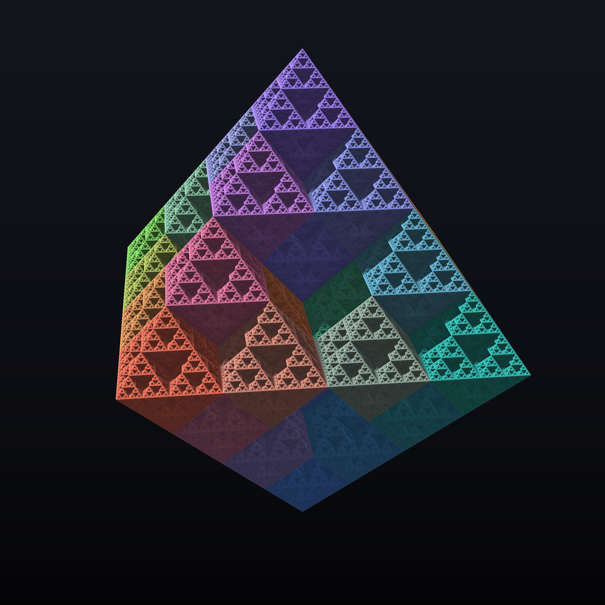
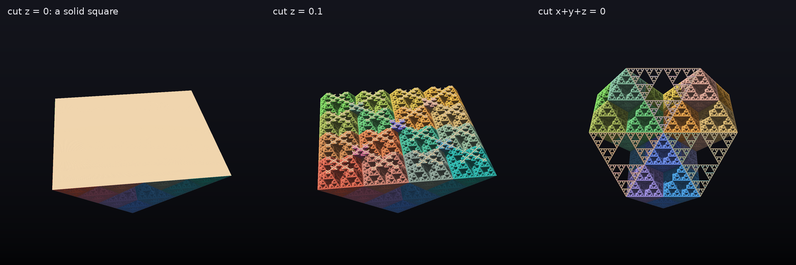
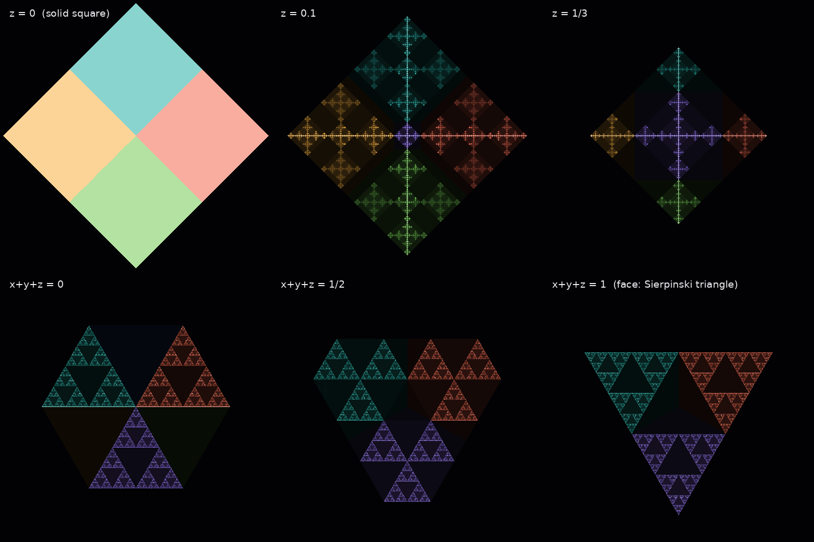
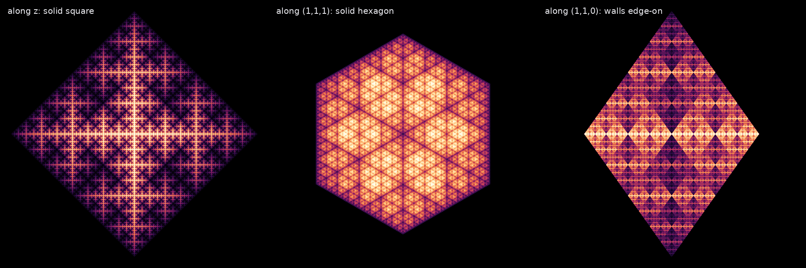
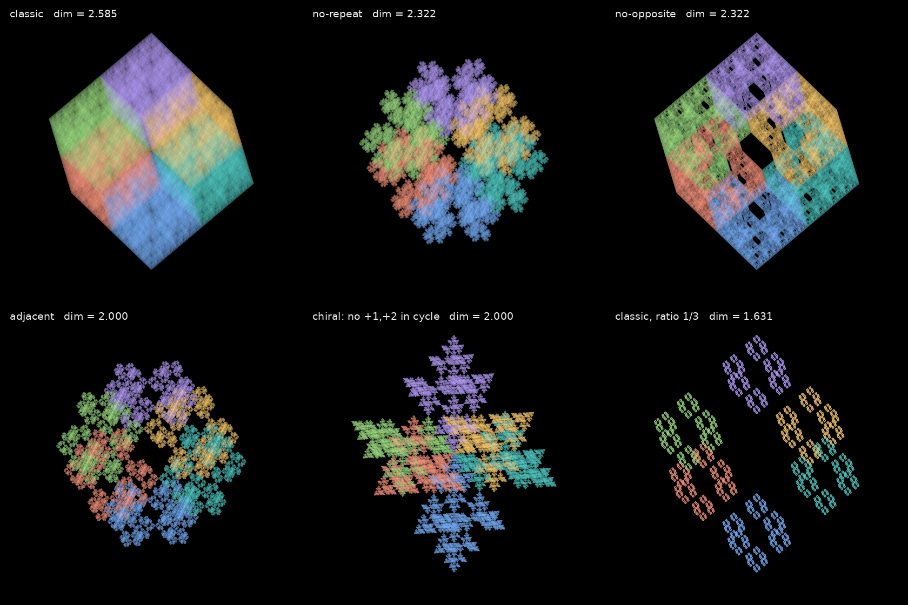
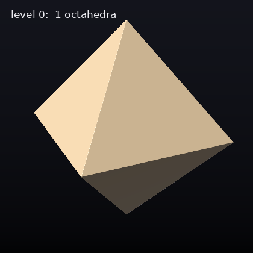
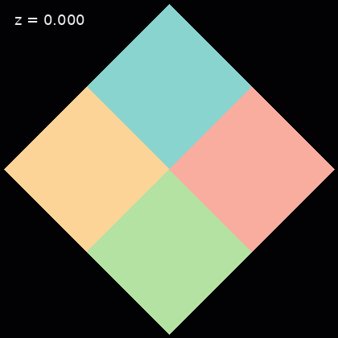
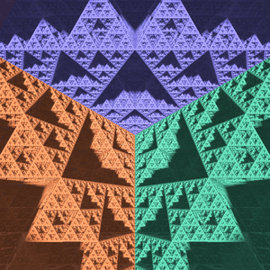

# fractals

**Sierpiński octahedron**

To reproduce the model:
 
**Install dependency**

`pip install pyvista numpy`

**Change iterations parametr**

for good model i recommend 100kk iterations, but you can make 10-20kk for good performance.

**run**

`python octahedron.py`

**choice:**

1 - Generate model

2 - Show model from file

3 - Generate gif

---

## Gallery & experiments

Extra scripts that need no VTK / GPU (`pip install numpy numba pillow`):

* `octaflake.py` – core: numba chaos game (~20M points/s, optional rules on consecutive
  vertices, any contraction ratio), exact membership test, distance estimator.
* `gallery.py` – renders everything below into `gallery/`: `python gallery.py all`
* `research.py` – numerical experiments (slice dimensions, shadows), ~3 s.

**Why octahedra.** The chaos game with ratio 1/2 toward the 6 vertices is the attractor of
6 maps `p -> (p + v)/2`. Each one shrinks the octahedron into a half-size copy at a vertex.
The six copies all touch at the centre, neighbours share a whole edge, and what is left
out are 8 tetrahedra (one under each face): it is the octet truss. So the fractal is
"octahedra all the way down", and its dimension is `log 6 / log 2 ≈ 2.585`.

**Hidden walls.** Each half-size copy is exactly `{p : |p_axis| >= sum of the other two}`.
The planes `x = 0`, `y = 0`, `z = 0` are invariant under the four equatorial maps, and those
four maps tile the square, so **every sub-octahedron contains three full solid squares**.
The faces, on the other hand, are Sierpinski triangles.

**Shadows.** Projections of the chaos-game measure (log density):

**Other rules.** Forbid certain vertices after the previous one; similarity dimension = log2 of the
spectral radius of the allowed-transition matrix.

| build-up by levels | plane sweeping through | seamless zoom into the centre |
|---|---|---|
|  |  |  |

**Numbers** (`python research.py`):

* points pile up near the walls: `mu(|z| < eps) ~ eps^0.585` (`log2(3/2)`)
* the slice `z = c` has dimension 2 for dyadic `c`, `≈ 1.546` for a typical `c`,
  `≈ 1.632` through a typical point of the measure, `1.357` for `c = 1/3`
  (Lyapunov exponent of products of `[[4,0],[1,1]]` and `[[1,1],[0,4]]`)
* the shadow of the measure on an axis has dimension `≈ 0.954 < 1`,
  and `0.954 + 1.632 = log2 6` (dimension conservation)
