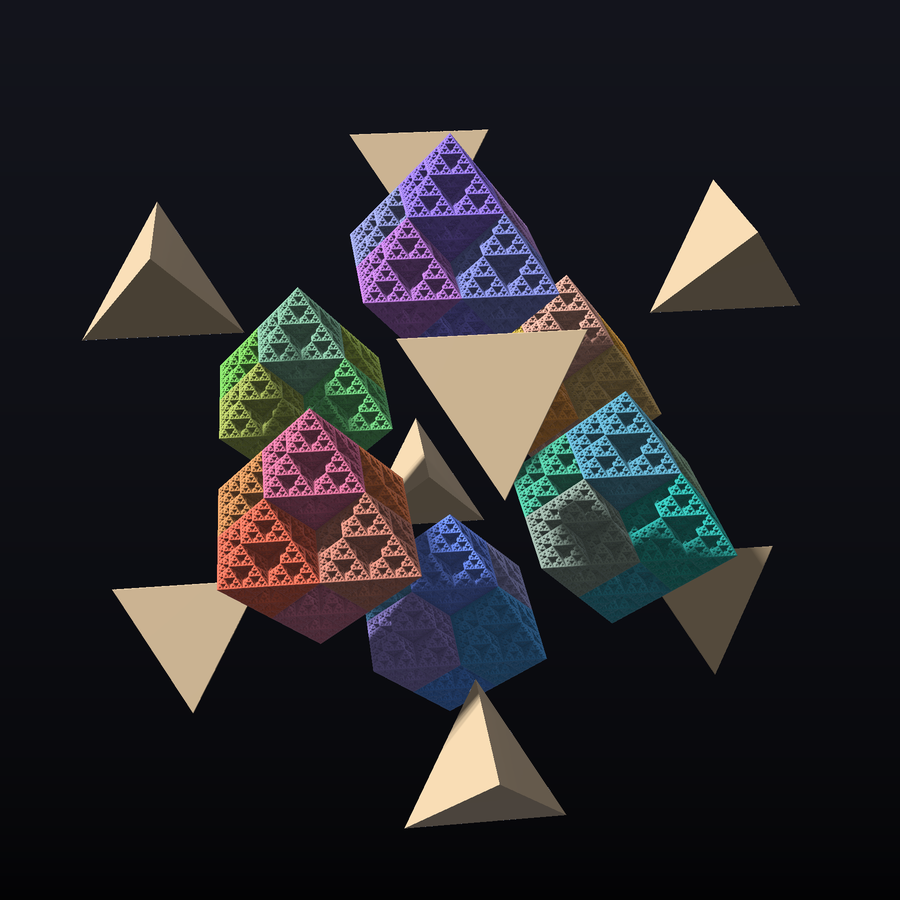
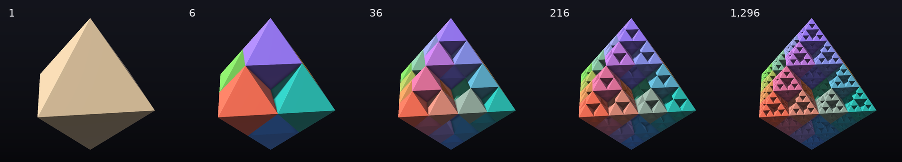
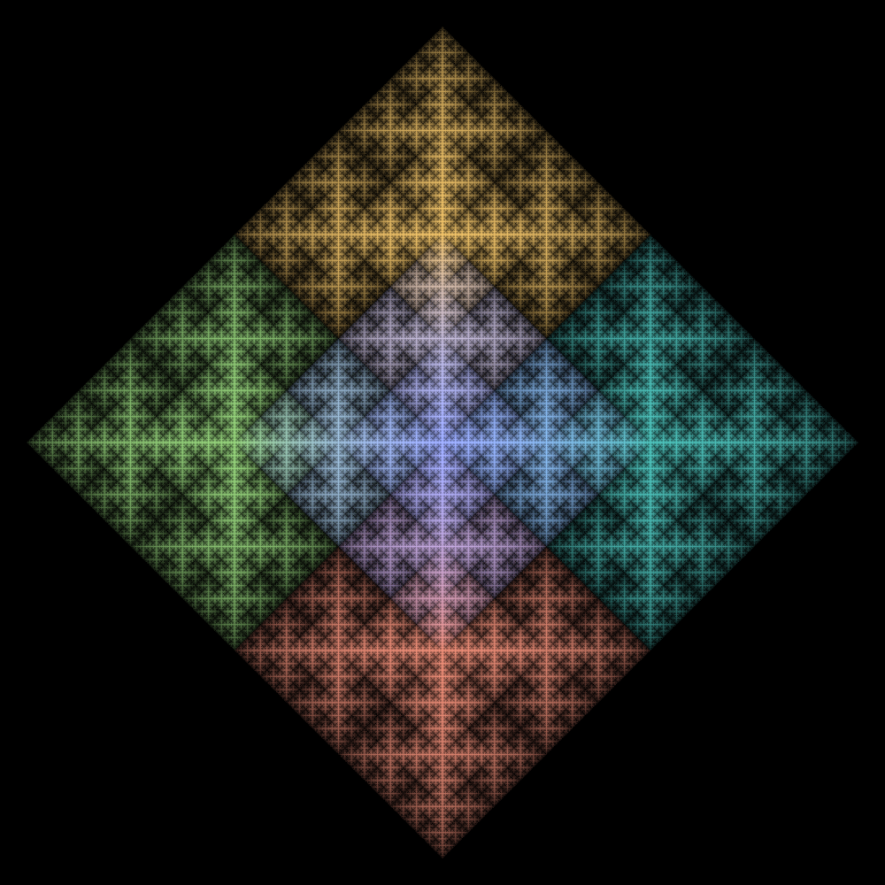

<div align="center">

# Иерархия октаэдров

### Sierpiński octahedron — фрактал, который рождает хаос-игра на шести вершинах октаэдра


**размерность log₂6 ≈ 2.585** · **6ⁿ октаэдров на уровне n** · **внутри — сплошные стенки**

[Как это получается](#как-это-получается) ·
[Почему октаэдры](#почему-октаэдры) ·
[Скрытые стенки](#скрытые-стенки) ·
[Тени](#точки-липнут-к-стенкам-тени) ·
[Анимации](#анимации) ·
[Другие правила](#другие-правила-игры) ·
[Исследование](#исследовательская-часть) ·
[Запуск](#как-запустить)

</div>

---

## Как это получается

Правило «хаос-игры» очень простое:

1. берём точку в центре октаэдра;
2. выбираем случайную из шести вершин;
3. сдвигаем точку **ровно на полпути** к этой вершине и ставим её на картинку;
4. повторяем миллионы раз.

<p align="center">
  
</p>

Вместо хаоса получается строгая структура. Каждый шаг — это одно из шести отображений

$$f_v(p) = \frac{p + v}{2}, \qquad v \in \{\pm e_x,\ \pm e_y,\ \pm e_z\},$$

и каждое из них сжимает **весь октаэдр** в копию вдвое меньше, прижатую к вершине `v`.
После n шагов точка лежит в подоктаэдре уровня n. Его «адрес» — последние n выбранных
вершин, причём последняя задаёт самый крупный кусок. Поэтому раскраска по последней
вершине в `octahedron.py` красит ровно 6 подоктаэдров верхнего уровня.

## Почему октаэдры

<p align="center">
  
</p>

Октаэдр раскладывается на **6 октаэдров вдвое меньше** (цветные) и **8 тетраэдров**
(кремовые), по одному под каждой гранью. Это то же разбиение, что в октет-ферме Бакминстера
Фуллера. Хаос-игра оставляет октаэдры и выбрасывает тетраэдры, и так на каждом уровне:

<p align="center">
  
</p>

- Все 6 копий сходятся в центре, а соседние делят **целое ребро**.
- За шаг остаётся 6/8 объёма, поэтому в пределе объём равен нулю, а размерность — дробная.
- Октаэдр — «двойник» тетраэдра Серпинского: там вырезается октаэдр, здесь тетраэдры.

|                              | Тетраэдр Серпинского | **Октаэдр Серпинского**                       |
|------------------------------|----------------------|-----------------------------------------------|
| вершин = копий               | 4                    | **6**                                         |
| что вырезается               | 1 октаэдр            | **8 тетраэдров**                              |
| как соприкасаются копии      | в точках             | **соседние по ребру, все шесть в центре**     |
| остаётся объёма за шаг       | 1/2                  | **3/4**                                       |
| размерность                  | log₂4 = 2            | **log₂6 ≈ 2.585**                             |
| грани                        | треугольники Серпинского | **треугольники Серпинского**              |

## Скрытые стенки

Главный сюрприз этого фрактала. Половинная копия у вершины `+x` — это в точности множество
`|x| ≥ |y| + |z|`, то же для остальных осей. Плоскость `z = 0` переходит в себя при четырёх
«экваториальных» отображениях, а они замощают квадрат без щелей. Значит:

> **в каждом подоктаэдре лежат три взаимно перпендикулярных _сплошных_ квадрата**,
> а грани при этом — «дырявые» треугольники Серпинского.

Снаружи фрактал дырявый, внутри — сплошной. Разрез это наглядно показывает:


Точные сечения плоскостью (тест принадлежности для каждого пикселя, а не облако точек).
Светлое лежит во фрактале. Дырки окрашены цветом своего подоктаэдра и тем ярче, чем позже
их вырезали, то есть чем ближе они к фракталу:


- **Горизонтальные сечения** складываются в фрактал из «крестов»: это стенки подоктаэдров
  всех масштабов, пересечённые плоскостью.
- **Сечение грани** `x + y + z = 1` — треугольник Серпинского.
- **Центральное сечение** `z = 0` — сплошной квадрат.

## Точки липнут к стенкам: тени

Раз стенки сплошные, хаос-игра к ним «притягивается». Доля точек в слое `|z| < ε`
растёт как

$$\mu(|z| < \varepsilon) \sim \varepsilon^{\log_2 (3/2)} = \varepsilon^{0.585},$$

и эксперимент совпадает с теорией до третьего знака. Например, **3% всех точек лежат в слое,
занимающем 0.47% объёма**. В проекциях это видно как яркие кресты. Ниже — логарифм плотности
точек в трёх направлениях:


Все три тени сплошные (квадрат, шестиугольник, ромб), как и положено множеству размерности
больше 2 (теорема Марстранда). Но плотность на них — сложный самоподобный узор.
Вот та же тень вдоль оси `z`, окрашенная по шести подоктаэдрам:

<p align="center">
  
</p>

## Анимации

| Рост по уровням | Плоскость проходит насквозь | Бесконечный зум в центр |
|:---:|:---:|:---:|
|  |  |  |
| 1 → 6 → 36 → … → 279 936 октаэдров | сечение `z = c`, c от 0 до 1 | петля без шва |

**Про зум.** Камера висит внутри одной из тетраэдрических дырок и смотрит на её вершину, то
есть на центр октаэдра. Стены вокруг — грани подоктаэдров `+x`, `+y`, `+z`. Возле центра
фрактал подобен сам себе с коэффициентом 2, поэтому полёт от расстояния `d` до `d/2`
замыкается в идеальную петлю.

## Другие правила игры

Если запретить некоторые вершины в зависимости от предыдущей, получаются новые фракталы.
Их размерность подобия равна `log₂ λ`, где `λ` — спектральный радиус матрицы разрешённых
переходов. Она совпадает с хаусдорфовой, если куски не перекрываются.


| Правило                                                    | λ | Размерность |
|------------------------------------------------------------|---|-------------|
| классика: любая вершина                                     | 6 | 2.585       |
| нельзя повторять вершину                                    | 5 | 2.322       |
| нельзя брать противоположную                               | 5 | 2.322       |
| только соседние                                            | 4 | 2           |
| хиральное: нельзя шагнуть на +1, +2 по циклу `+x→+y→+z→−x→−y→−z` | 4 | 2     |

Коэффициент сжатия `r` тоже меняет всё:

| `r`            | что получается                                                    |
|----------------|-------------------------------------------------------------------|
| `< 1/2`        | пыль из несвязных кусков, размерность `log 6 / log(1/r)` (для 1/3 это 1.631) |
| `= 1/2`        | копии касаются по рёбрам — наш фрактал                             |
| `1/2 … 2/3`    | копии перекрываются, плотность становится сложной (теория Хохмана) |
| `≥ 2/3`        | копии полностью заполняют октаэдр (проверено численно)             |

## Исследовательская часть

Сам объект известен как octahedron flake. Ниже — свойства, которые я посчитал численно
(`python research.py`, несколько секунд).

### Размерность сечений `z = c`

Число кусочков уровня n, которые задевает плоскость, сводится к произведению двух матриц 2×2,
выбираемых по двоичным цифрам числа `c`:

$$M_0 = \begin{pmatrix} 4 & 0 \\ 1 & 1 \end{pmatrix}, \qquad
  M_1 = \begin{pmatrix} 1 & 1 \\ 0 & 4 \end{pmatrix},$$

а размерность сечения равна показателю Ляпунова этого произведения, делённому на `log 2`.

| Сечение                                              | Размерность |
|------------------------------------------------------|-------------|
| `c` двоично-рациональное (0, 1/2, 3/8, …)            | **2** — внутри сплошные квадраты |
| `c = 1/7`                                            | 1.489       |
| `c = 1/3`                                            | 1.357       |
| типичное `c`                                         | ≈ 1.546     |
| через типичную точку фрактала                        | ≈ 1.632     |
| *для типичного направления (Марстранд): dim − 1*     | *1.585*     |

Координатная ось оказывается **исключительным направлением**, причём отклонение от 1.585 идёт
в обе стороны. Функция `c ↦ dim` разрывна всюду.

### Тень на ось и сохранение размерности

Проекция всех точек на ось заполняет весь отрезок, но распределение на нём **сингулярно**: его
размерность ≈ **0.954 < 1** (энтропия Гарсиа). Причина — точные совпадения адресов,
например `½ − ¼ = 0 + ¼`. При этом

$$0.954 + 1.632 = 2.585 = \log_2 6,$$

то есть численно выполняется «сохранение размерности» Фюрстенберга: размерность тени плюс
размерность типичного сечения равна размерности всего фрактала.

### Открытые вопросы

- Спектр сечений: какие размерности встречаются и насколько часто
  (мультифрактальный формализм для произведений матриц, работы Фэна).
- Минимум размерности сечения — совместный спектральный подрадиус `{M₀, M₁}`,
  классически трудная задача.
- Классификация правил хаос-игры: какие дают связные, гомеоморфные или новые фракталы.
- Режим перекрытий `1/2 < r < 2/3`: где распределение точек абсолютно непрерывно,
  а где сингулярно.
- 4D: у 16-ячейника такая же игра даёт размерность ровно 3.

> Похожие результаты о сечениях известны для ковра и треугольника Серпинского
> (Manning–Simon, Bárány–Ferguson–Simon). Работы именно про октаэдр мне неизвестны, но перед
> публикацией литературу стоит проверить.

## Как запустить

### Исходный скрипт (PyVista)

```bash
pip install pyvista numpy
python octahedron.py
```

Меню: `1` — сгенерировать модель, `2` — показать модель из файла, `3` — сделать GIF.
Число итераций задаётся в `ITERATIONS`. Хорошая модель получается от 100 млн, для быстрой
работы хватит 10–20 млн.

> ⚠️ Цикл на Python хранит каждую точку отдельным numpy-массивом, поэтому 100–200 млн
> итераций требуют десятки гигабайт памяти. Быстрый генератор ниже решает эту проблему.

### Галерея и эксперименты (без VTK и видеокарты)

```bash
pip install numpy numba pillow
python gallery.py all        # все картинки и анимации → gallery/
python gallery.py hero cutaway slices   # или отдельные сцены
python research.py           # численные эксперименты
```

Сцены: `hero`, `exploded`, `levels`, `cutaway`, `slices`, `xray`, `variants`, `build`,
`sweep`, `zoom`.

### Быстрый генератор в своём коде

```python
import octaflake as of

pts, code = of.chaos_game(50_000_000)     # float32 (N, 3), ~17 млн точек в секунду
piece = code // 6                          # подоктаэдр верхнего уровня, 0..5
piece2 = code % 6                          # подоктаэдр второго уровня

# другие правила и коэффициенты
pts, code = of.chaos_game(10_000_000, rule="no-repeat")
pts, code = of.chaos_game(10_000_000, rule=of.cyclic_rule(1, 2), ratio=0.5)
```

Интерактивный разрез в PyVista:

```python
import pyvista as pv

cloud = pv.PolyData(pts)
cloud["piece"] = piece
pl = pv.Plotter()
pl.add_mesh_clip_plane(cloud, normal="z", scalars="piece", cmap="tab10", point_size=1)
pl.enable_eye_dome_lighting()
pl.show()
```

### Структура

| Файл           | Что внутри                                                                      |
|----------------|---------------------------------------------------------------------------------|
| `octahedron.py`| исходный скрипт: генерация, просмотр и GIF в PyVista                            |
| `octaflake.py` | ядро: хаос-игра на numba, правила, точный тест принадлежности, distance estimator |
| `gallery.py`   | рендер всех картинок: ray marching, сечения, тени, анимации                     |
| `research.py`  | сечения, энтропия Гарсиа, проверка сохранения размерности                       |
| `gallery/`     | готовые картинки и GIF                                                          |

## Ссылки

- [Chaos game](https://en.wikipedia.org/wiki/Chaos_game) — хаос-игра
- [n-flake](https://en.wikipedia.org/wiki/N-flake) — семейство «снежинок», включая octahedron flake
- [Sierpiński triangle](https://en.wikipedia.org/wiki/Sierpi%C5%84ski_triangle) — плоский предок
